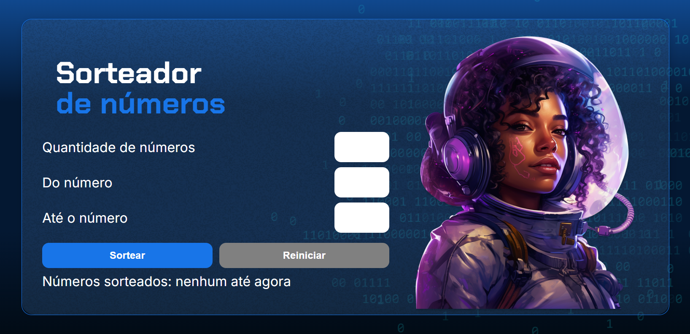

# 🎲 Sorteador de Números

Um simples sorteador de números, onde o usuário pode definir **quantos números deseja sortear** e **o intervalo entre eles**.  

🚀 **Tecnologias utilizadas:**  
✅ HTML | ✅ CSS | ✅ JavaScript  

---

## 📸 Demonstração  

 

---

## 🎯 Funcionalidades  

✅ Defina a quantidade de números a serem sorteados  
✅ Escolha o intervalo mínimo e máximo dos números  
✅ Evita números repetidos no sorteio  
✅ Interface simples e intuitiva  

---

## 🛠 Como rodar o projeto?  

1. Acesse o  [link](https://sorteador-de-numeros-phdiass-projects.vercel.app/)

---

## 🚀 Aprendizados  

Durante o desenvolvimento deste projeto, aprimorei minhas habilidades em:  
✔️ **Lógica de programação**  
✔️ **Manipulação do DOM com JavaScript**  
✔️ **Melhoria na estrutura do código e boas práticas**  

---

## 📌 Melhorias futuras  

🔹 **Adicionar animações e transições** para uma experiência mais fluida  
🔹 **Criar um layout responsivo** para dispositivos móveis  
🔹 **Implementar um modo escuro**  

---

## 🙌 Agradecimento Especial  

Gostaria de expressar minha gratidão aos incríveis professores da **Alura**, que compartilharam seus conhecimentos e contribuíram para meu aprendizado nesta jornada. Muito Obrigado! 🚀

### 🎓 **Jacqueline Oliveira**  
  
  

---

### 🎓 **Rodrigo da Silva Ferreira Caneppele**  
  
  

